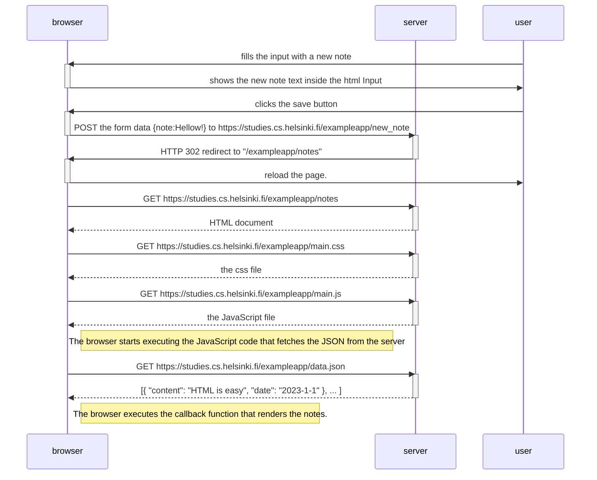

ADD A NEW NOTE SEQUENCE

```mermaid
sequenceDiagram
    participant browser
    participant server
    participant user

    user->>browser: fills the input with a new note
    activate browser
    browser->>user: shows the new note text inside the html Input
    deactivate browser

    user->>browser: clicks the save button
    activate browser
    browser->>server: POST the form data {note:Hellow!} to https://studies.cs.helsinki.fi/exampleapp/new_note
    deactivate browser
    activate server
    server->>browser: HTTP 302 redirect to "/exampleapp/notes"
    deactivate server
    activate browser
    browser->>user: reload the page.
    deactivate browser

    browser->>server: GET https://studies.cs.helsinki.fi/exampleapp/notes
    activate server
    server-->>browser: HTML document
    deactivate server

    browser->>server: GET https://studies.cs.helsinki.fi/exampleapp/main.css
    activate server
    server-->>browser: the css file
    deactivate server

    browser->>server: GET https://studies.cs.helsinki.fi/exampleapp/main.js
    activate server
    server-->>browser: the JavaScript file
    deactivate server

    Note right of browser: The browser starts executing the JavaScript code that fetches the JSON from the server

    browser->>server: GET https://studies.cs.helsinki.fi/exampleapp/data.json
    activate server
    server-->>browser: [{ "content": "HTML is easy", "date": "2023-1-1" }, ... ]
    deactivate server

    Note right of browser: The browser executes the callback function that renders the notes.
```