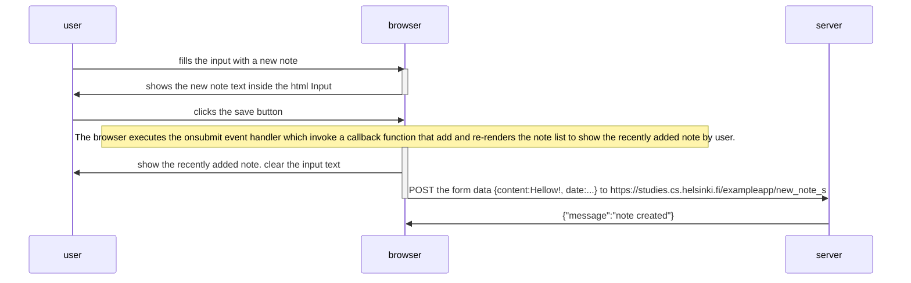

ADD A NEW NOTE SEQUENCE IN SPA

```mermaid
sequenceDiagram
    participant user
    participant browser
    participant server


    user->>browser: fills the input with a new note
    activate browser
    browser->>user: shows the new note text inside the html Input
    deactivate browser

    user->>browser: clicks the save button

    Note over browser: The browser executes the onsubmit event handler which invoke a callback function that add and re-renders the note list to show the recently added note by user.
    activate browser
    browser->>user: show the recently added note. clear the input text
    browser->>server: POST the form data {content:Hellow!, date:...} to https://studies.cs.helsinki.fi/exampleapp/new_note_s
    deactivate browser
    server->>browser:  {"message":"note created"}
```